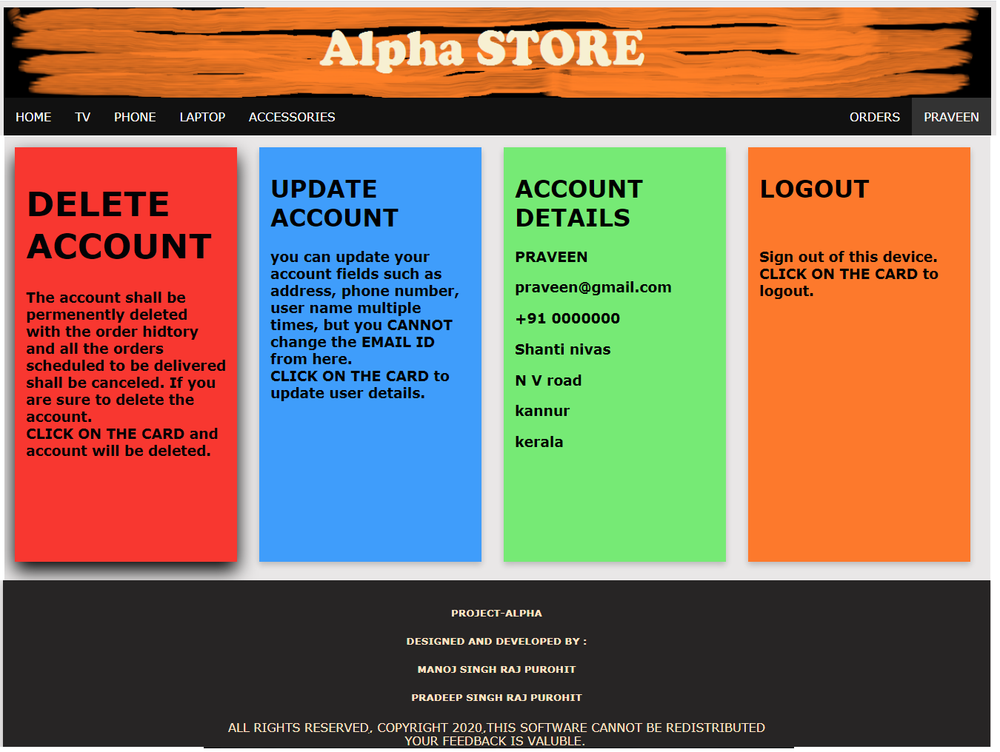

# Alpha Store

Alpha Store is an e-commerce web application that allows users to browse and purchase various electronic products including TVs, phones, laptops, and accessories.
Developed as a college project in 2020

## Project Overview

This project is a PHP-based e-commerce platform with a MySQL database backend, containerized using Docker for easy setup and deployment. The application provides user authentication, product browsing, order management, and user account management.

## Tech Stack

- **Frontend**: HTML, CSS, JavaScript
- **Backend**: PHP
- **Database**: MySQL 8.0
- **Containerization**: Docker and Docker Compose

## Features

- **User Authentication**: Login and signup functionality
- **Product Browsing**: Browse products by categories (TV, Phone, Laptop, Accessories)
- **Product Pages**: Detailed product information
- **Shopping Cart**: Add products to cart and checkout
- **Order Management**: Track and manage orders
- **User Account Management**: Update user information and view order history
- **Admin Panel**: For managing products and orders (accessible to administrators)

## Screenshots

<table>
  <tr>
    <td></td>
    <td></td>
    <td></td>
  </tr>
  <tr>
    <td></td>
    <td></td>
    <td></td>
  </tr>
  <tr>
    <td></td>
    <td></td>
    <td></td>
  </tr>
  <tr>
    <td></td>
    <td></td>
    <td></td>
  </tr>
  <tr>
    <td></td>
    <td></td>
    <td></td>
  </tr>
  <tr>
    <td></td>
    <td></td>
    <td></td>
  </tr>
</table>

## Project Structure

```
alpha-store/
├── docker-compose.yaml   # Docker Compose configuration
├── Dockerfile            # Docker image configuration
└── src/                  # Source code
    ├── index.php         # Entry point (redirects to web.php)
    ├── web.php           # Main application file
    ├── webjs.php         # JavaScript functions
    ├── style.css         # CSS styles
    ├── initialsetup.php  # Database initialization
    ├── formphp/          # Form processing PHP files
    ├── include/          # PHP includes
    └── resources/        # Static resources (images, etc.)
```

## Setup and Installation

### Prerequisites

- Docker
- Docker Compose

### Installation Steps

1. Clone the repository:
   ```
   git clone repo_url
   cd alpha_store
   ```

2. Build and start the containers:
   ```
   docker-compose up -d
   ```

3. Access the application:
   - First time users will have to navigate `http://localhost:8080/initialsetup.php` to create necessary database and tables with preloaded products as demo.
   - Open your browser and navigate to `http://localhost:8080`
   - The initial setup will create the database tables automatically

### Database Configuration

The default database configuration is:
- **Host**: mysql
- **Database**: my_database
- **Username**: root
- **Password**: root

You can modify these settings in the `docker-compose.yaml` file if needed.

## Usage

1. **Browse Products**: Navigate through different product categories using the navigation menu.
2. **View Product Details**: Click on a product card to view detailed information.
3. **Create an Account**: Click on "LOGIN" and then "sign up" to create a new account.
4. **Place Orders**: After logging in, you can purchase products.
5. **View Orders**: Access your order history through the "ORDERS" link in the navigation menu.
6. **Manage Account**: Update your account information from the account page.

## Development

### Making Changes

1. Edit files in the `src` directory
2. Changes will be immediately reflected due to the volume mounting in Docker Compose

### Debugging

- Check the `debug.log` file for error messages and debugging information


